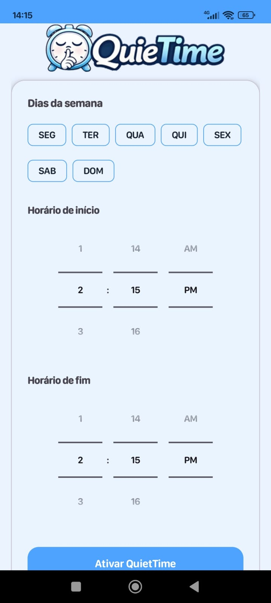
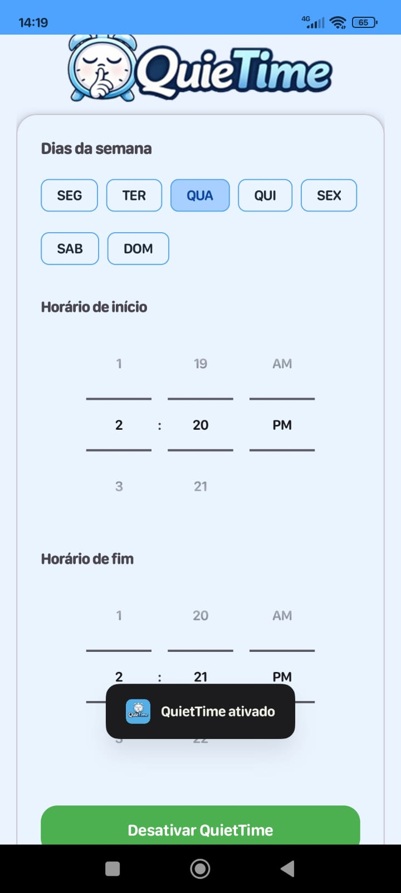

# 🔕 QuieTime

QuieTime é um aplicativo Android que permite **agendar automaticamente o modo Não Perturbe / Silencioso** do celular em dias e horários definidos pelo usuário.

Ideal para estudos, trabalho, reuniões ou descanso — sem precisar ativar tudo manualmente.

---

## 📱 Funcionalidades

- ⏰ Definir **horário de início e fim**
- 📅 Selecionar **dias da semana**
- 🔇 Ativar automaticamente o **Não Perturbe**
- 🔊 Retornar ao **modo som** no horário configurado
- 🔁 Funciona semanalmente de forma automática
- 🎨 Interface simples, limpa e intuitiva

---

## 🛠️ Tecnologias utilizadas

- **Kotlin**
- **Android SDK**
- **Material Design 3**
- **AlarmManager**
- **BroadcastReceiver**
- **NotificationManager**
- **SharedPreferences**

---

## 🔐 Permissões necessárias

O app solicita apenas permissões essenciais para funcionar corretamente:

- **Acesso ao Não Perturbe (DND)**  
  Necessário para ativar/desativar o modo silencioso automaticamente.

- **Notificações** (Android 13+)  
  Para funcionamento correto em versões mais recentes do Android.

> ⚠️ Em alguns dispositivos (ex: Xiaomi/Redmi), pode ser necessário permitir o funcionamento em segundo plano nas configurações do sistema.

---

## 📱 Screenshots do app

  
  
  

